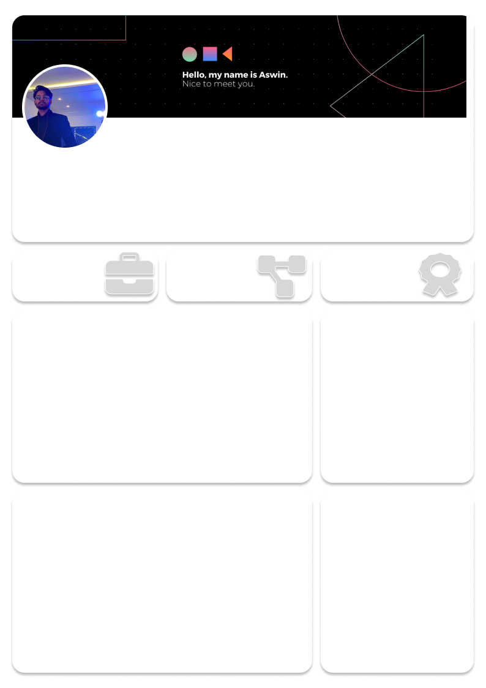

# Power BI CV Dashboard  

  

[CV Dashboard Preview](https://app.powerbi.com/view?r=eyJrIjoiZmRlZTJhZjEtOGY3ZS00ZDliLWJjODctMDNmZjVlYmZhOGM2IiwidCI6IjBmZGYwYzdmLTA2OWMtNDE0YS05MTM2LWQwZjRlYmIzMDliOSJ9)  

## 📌 Overview  

This project is an **interactive Power BI dashboard** designed as a **visual CV / resume**. It highlights professional experience, skills, education, and achievements in a clean and data-driven way.  

The dashboard is **based on my LinkedIn profile**, transforming a traditional resume into a **visual, interactive career story**. This provides recruiters and hiring managers with a **quick, engaging summary** of career highlights compared to text-only resumes.  

## 📂 Project Structure  

```bash
./powerbi-cv
├── README.md
├── assets
│   ├── icons
│   │   ├── certificate.svg
│   │   ├── experience.svg
│   │   └── project.svg
│   └── template.png
├── cv-dashboard.jpg
└── cv-dashboard.pbix
```

## 🚀 Features  

- 📊 Interactive visuals for career timeline, skills, and projects  
- 🎨 Custom visuals and icons for a professional look  
- 📈 KPI cards to summarize achievements and performance  
- 🖼️ Template-based design for consistency  

## 🛠️ Tools & Technologies  

- **Power BI Desktop** – dashboard design and data visualization  
- **DAX (Data Analysis Expressions)** – measures and calculated columns  
- **Custom Visuals** – icons, images, and design enhancements  

## 📸 Screenshots  

### Dashboard Preview  

  

## 📖 How to Use  

1. Download or clone this repository.  
2. Open `cv-dashboard.pbix` in **Power BI Desktop**.  
3. Customize the data (education, work experience, skills, projects) as per your profile.  
4. Export as PDF or publish to Power BI Service for sharing.  

## 📜 License  

This project is licensed under the **MIT License** – feel free to use and customize for personal use.  
